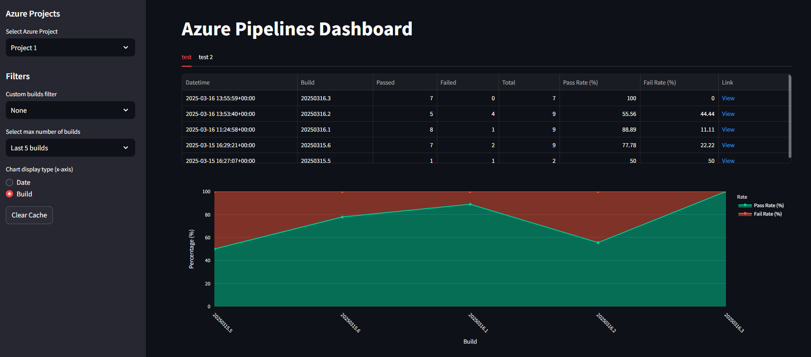

# Azure Pipelines Dashboard

A Streamlit application to visualize and analyze Azure Pipelines build and test results.



## Overview

This dashboard fetches build data and aggregated test results from Azure DevOps Pipelines and provides insights through interactive visualizations.

## Features

- **Pipeline Selection:** Choose a specific Azure Pipeline to analyze.
- **Build Filtering:** Filter builds by predefined criteria set in `config.yml`.
- **Caching:** Data is cached to optimize performance and reduce API calls.
- **Interactive Visualizations:** Trend analysis of pass/fail rates using Plotly.

## Configuration

The application requires a `config.yml` file with the following structure:

```yaml
organization: "<your_azure_devops_organization>"
project: "<your_azure_devops_project>"
pat: "<your_personal_access_token>"  # Alternatively, use AZURE_PAT environment variable
pipelines:
  "<pipeline_name_1>": "<pipeline_id_1>"
  "<pipeline_name_2>": "<pipeline_id_2>"
default_pipeline: "<default_pipeline_name>"
build_filters:
  "<filter_name_1>": "<filter_keyword_1>"
  "<filter_name_2>": "<filter_keyword_2>"
max_builds_option: [5, 10, 30, 50, 100]  
```

## Prerequisites

Install dependencies:
```bash
pip install -r requirements.txt
```

## Usage

Run the Streamlit application with:

```bash
streamlit run app.py
```

Open your web browser to view the dashboard at:

```
http://localhost:8501
```

### Localhost Only Mode (Optional)

To make the app accessible only locally (recommended for security), use the following command:

```bash
streamlit run app.py --server.address localhost
```

This ensures the dashboard will only be accessible via the local machine.

## Components

- **Streamlit:** Web app framework.
- **Azure DevOps REST API:** Fetches builds and test results.
- **Plotly Express:** Interactive data visualizations.

## License

This project is licensed under the MIT License - see the [LICENSE](LICENSE) file for details.